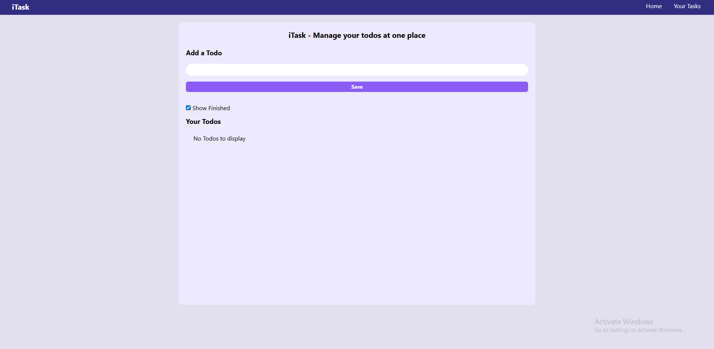

# ✅ React Todo List App

## 📌 Project Overview

**React Todo List** is a simple and responsive task management application built using **React.js** and **Tailwind CSS**.

It allows users to add, edit, delete, and mark tasks as completed, with data stored in **Local Storage** so tasks persist even after refreshing the page.

This project demonstrates core React concepts such as:

* Components
* State management
* Event handling
* Conditional rendering
* Local storage integration

---

## 🚀 Live Demo

🔗 **Live Website:**
https://mayuresh-2601.github.io/React-Todo-List

---

## 🎯 Key Features

✔ Add new tasks
✔ Edit existing tasks
✔ Delete tasks
✔ Mark tasks as completed
✔ Show / Hide completed tasks
✔ Data persistence using Local Storage
✔ Responsive UI design
✔ Clean and simple interface

---

## 🛠️ Technologies Used

* React.js
* JavaScript (ES6+)
* Tailwind CSS
* HTML5
* Vite
* UUID (for unique task IDs)
* Git & GitHub
* GitHub Pages (Deployment)

---

## 📂 Project Structure

React-Todo-List/
│
├── public/
├── src/
│   ├── components/
│   │   └── Navbar.jsx
│   ├── App.jsx
│   ├── main.jsx
│   ├── index.css
│
├── package.json
├── vite.config.js
└── README.md

---

## 🧠 Functionalities Implemented

### ➕ Add Task

* User enters task in input field
* Clicks **Save** button
* Task is added to the list

### ✏ Edit Task

* Click edit button
* Task loads into input field
* User updates and saves

### 🗑 Delete Task

* Removes selected task from list

### ✅ Mark as Completed

* Checkbox toggles task completion
* Completed tasks show with strikethrough

### 💾 Local Storage

* Tasks saved automatically
* Data persists after refresh

---

## 📊 UI & UX Highlights

* Minimal and clean design
* Responsive layout
* Smooth user interaction
* Accessible interface
* Mobile-friendly styling
* Tailwind CSS utility classes

---

## 📈 What I Learned

* React functional components
* useState and useEffect hooks
* Managing application state
* Handling user events
* Working with Local Storage
* Component-based architecture
* Git and GitHub workflow
* Deploying React apps to GitHub Pages

---

## 🚀 How to Run This Project Locally

### 1. Clone the repository

git clone https://github.com/mayuresh-2601/React-Todo-List.git

### 2. Navigate into the project folder

cd React-Todo-List

### 3. Install dependencies

npm install

### 4. Start development server

npm run dev

---

## 🌐 Deployment

This project is deployed using:

GitHub Pages

To deploy again:

npm run deploy

---

## 👨‍💻 Author

**Mayuresh Kasar**
Frontend Developer | Web Development Learner

GitHub:
https://github.com/mayuresh-2601

---

## ⭐ Support

If you found this project helpful or interesting, consider giving it a ⭐ on GitHub!
